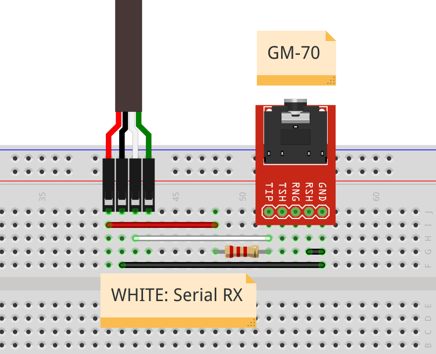

# VOLTCRAFT GM-70 TESLAMETER TO REST

This application converts the serial output from the Voltcraft GM-70 Teslameter into a simple REST API.


## GM-70 SERIAL PROTOCOL

The device sends a 16 BYTES message each second.

| BYTE |                    | VALUE                      |
|------|--------------------|---------------------------:|
| 0    | startbyte          | 2 (dec)                    |
| 1    | identifier 1       | 4 (dec)                    |
| 2    | identifier 2       | 1 (dec)                    |
| 3    | unit 1             | 'B' => Gauss, 'E' => mT    |
| 4    | unit 2             |                            |
| 5    | polarity           | '0' => NORTH, '1' => SOUTH |
| 6    | decimal dot offset | '1' => *0.1, '2' => *0.2   |
| 7    | value MSB          |                            |
| 8    |                    |                            |
| 9    |                    |                            |
| 10   |                    |                            |
| 11   |                    |                            |
| 12   |                    |                            |          
| 13   | value LSB          |                            |
| 14   | stopbyte           |  '\r'                      |     

## GM-70 ELECTRICAL INTERFACE

The `GM-70` uses a optocoupler on the Serial-RX output and is connected to the 3.5mm Jack on the `Tip Pin1` and `Sleeve Pin4`. To interface the optocoupler a additional `2.2k` pull-up resistor is needed between `Tip` and a `5V Vcc`.
The `Sleeve` is connected to `Ground Vss`.
Finally the `RX` Signal can be found on `Tip` and can be connected to `RX` of an USB-Serial converter.




**PLEASE NOTE**
The GM-70 disable its Serial-Ouput if the battery voltage is low (display icon). Use a external 9V Power-Supply to power the device!
You can use a small step-up converter from the 5V serial-usb converter.


## GM-70 DISABLE POWER OFF

To disable the automatic power off function, use the `Poff` menu entry:

* HOLD `MODE`, 2 seconds
* PRESS `REC`, until `Poff`
* PRESS `MODE`, to switch setting to `No`
* PRESS `REC`, to save config


## INSTALLATION

### SINGLE LINE INSTALLATION

#### UDEV RULES

**Modify the `99-gm70rest.rules` according your needs!**

```bash
$ lsusb
#Bus 001 Device 005: ID 1a86:7523 QinHeng Electronics CH340 serial converter

$ cat ./service/99-gm70rest.rules
## CREATE SYMBLINK BY VENDOR - PRODUCT ID
# SUBSYSTEM=="tty", ATTRS{idVendor}=="1a86", ATTRS{idProduct}=="7523", SYMLINK+="ttyGM70"

## CREATE SYMBLONK BY USB LOCATION
# SUBSYSTEM=="tty", ATTRS{devpath}=="1.5", SYMLINK+="ttyGM70"
```

#### INSTALL
```bash
## INSTALLS BINARY AND SYSTEMD SERVICE
$ export GM70REST_INSTALL_DIR="/home/$USER/gm70rest"
$ sudo -E bash ./service/install_service.sh 

$ sudo usermod -a -G dialout $USER
```

### MANUAL INSTALLATION

**C++17 IS REQUIRED TO BUILD CAN2REST**

#### BUILD
``` bash
$ cd ./src
$ cmake .
$  make
$ chmod +x ./gm70rest
``` 

#### RUN

```bash
$ ./gm70rest -help
# ---- HELP ----
# -help                   | this message
# -version                | print version
# -writeconfig            | creates default config
# ---- END HELP ----

$ ./gm70rest -version
# ---- GM70REST VERSION ----
# version:0.1.0
# build date:Feb 25 2022
# build time:21:55:51


# CREATE DEFAULT CONFIG FILE
# CREATES ./gm70rest_config.ini
$ ./gm70rest -writeconfig
$ cat ./gm70rest_config.ini
# [SETTINGS]
# REST_WEBSERVER_ENABLE=1
# REST_WEBSERVER_BIND_PORT=4240
# REST_WEBSERVER_BIND_HOST=0.0.0.0
# GM70_SERIAL_INTERFACE=/dev/ttyUSB0
# PACKET_QUEUE_LEN=10
# READ_VALUE_AVG_LEN=3


# NORMAL STARTUP
$ ./gm70rest
#        loguru.cpp:612   INFO| -----------------------------------
#        loguru.cpp:770   INFO| Logging to './gm70rest.log', mode: 'w', verbosity: 9
#        loguru.cpp:770   INFO| Logging to './gm70rest.log', mode: 'w', verbosity: -1
#          main.cpp:73    INFO| { LOADING CONFIG FILE ./gm70rest_config.ini
# config_parser.cpp:108   INFO| .   config_arser::loadConfigFile WITH FILE ./gm70rest_config.ini
#          main.cpp:85    INFO| .   CONFIG FILE LOADED
#      rest_api.cpp:44    INFO| .   rest_api start thread
#          main.cpp:112   INFO| .   STARTING MAIN LOOP
```


## CONFIGURATION

```bash
$ cat ./gm70rest_config.ini

# [SETTINGS]
# WEBSERVER SETTINGS
# REST_WEBSERVER_ENABLE=1
# REST_WEBSERVER_BIND_PORT=4240
# REST_WEBSERVER_BIND_HOST=0.0.0.0

## SERIAL INTERFACE PATH
# GM70_SERIAL_INTERFACE=/dev/ttyUSB0

## SETTINGS FOR AVG
# PACKET_QUEUE_LEN=10
# READ_VALUE_AVG_LEN=3

```

## REST-API USAGE


### GET CURRENT VALUE

```bash
# GET LAST VALUE
$ curl http://127.0.0.1:4240/current
```

```json
{
   "decimal_offset":"OFFSET_1",
   "polarity":"NORTH",
   "timestamp":1647262861,
   "unit":"MILLI_TESLA",
   "valid":true,
   "value":51.100002288818359
}
```

**PLEASE NOTE:**
Check the `valid` field!
The value is only valid if the value is set to `true`.
A `false` value can occur, if the GM-70 is not detected or the connection has failed.
